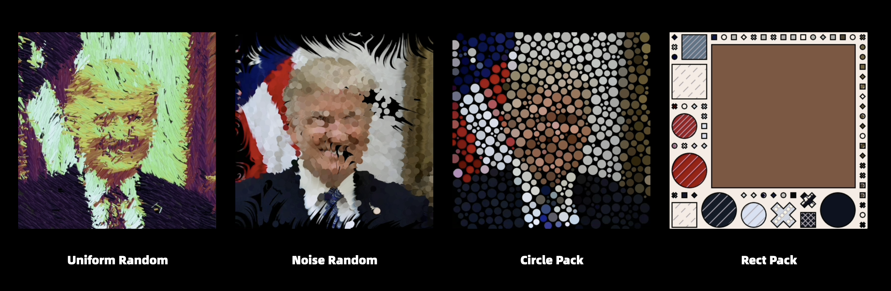

# HAP: Hackers and Painters

> HAP is built on [React.js](https://react.dev/) and [Charming.js](https://github.com/charming-art/charming).

Turn your avatar into artwork with algorithm visualization and AI.

## Inspiration

In the digital world, avatars are our virtual visages. Why not make them stand out and be memorable like works of art?

Both hackers and painters are artists, capable of creating beautiful artworks. In the HAP (Hacker and Painter) world, hackers use a series of classic algorithms as filters to visually transform avatars, while painters employ a range of AI filters to remodel avatars by transferring styles or learning from classic masterpieces of the world.

I hope that while users acquire a unique new avatar, they can also appreciate the beauty of algorithms and the charm of world-famous paintings.

## TODO

HAP is a new project with a lot of features yet to be implemented. If you find the following TODOs interesting, welcome to contribute!

- [ ] Add more hacker filters:
  - [ ] BFS, DFS, Prim
  - [ ] Sorting
  - [ ] Binary Search
  - [ ] Delaunay
  - [ ] Voronoi
  - [ ] ...
- [ ] Add a editor panel to customize each filter.
- [ ] Add painter filters: AI filters.
