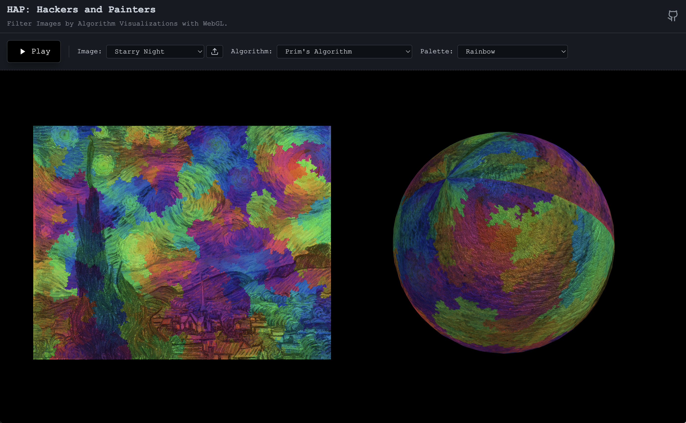

# HAP: Hackers and Painters

I've been always interested in artistic image processing, such as [Jason Labbe](https://openprocessing.org/user/60876/#sketches)'s [Portrait Painter](https://openprocessing.org/sketch/392202). I love exploring color transformations with original images. I'm also a big fan of [Mike Bostock](https://bost.ocks.org/mike/)'s [Visualizing Algorithms](https://bost.ocks.org/mike/algorithms/), where it's amazing to get pretty pattens that capture the core essence of each algorithm.

These works made me wonder: can we apply such beautiful patterns to images? To explore this idea, I created [HAP](https://hap.bairui.dev/), an online platform that filters images using algorithm visualizations powered by WebGL. The core concept is that color encoding is not only determined by the processing data structures—it also takes into account the original pixel color at each position.

I implemented a WebGL-powered [filter API](https://github.com/pearmini/hap/blob/main/src/lib/filter.js) that blends colors into [polygons](https://github.com/pearmini/hap/blob/main/src/lib/filter.js#L57) or [points](https://github.com/pearmini/hap/blob/main/src/lib/filter.js#L107) areas of the source image, which can also be mapped onto a [sphere](https://github.com/pearmini/hap/blob/main/src/lib/sphere.js) as well. Areas are computed by the following algorithms:

- Sampling: [Uniform](https://github.com/pearmini/hap/blob/main/src/lib/randomUniform.js), [Normal](https://github.com/pearmini/hap/blob/main/src/lib/randomNormal.js), and [Poisson Disc](https://github.com/pearmini/hap/blob/main/src/lib/randomPoissonDisc.js).
- Searching: [Binary Search](https://github.com/pearmini/hap/blob/main/src/lib/searchBinary.js) and [Golden Search](https://github.com/pearmini/hap/blob/main/src/lib/searchGolden.js).
- Sorting: [Bubble Sort](https://github.com/pearmini/hap/blob/main/src/lib/sortBubble.js), [Insertion Sort](https://github.com/pearmini/hap/blob/main/src/lib/sortInsertion.js), [Quick Sort](https://github.com/pearmini/hap/blob/main/src/lib/sortQuick.js) and [Selection Sort](https://github.com/pearmini/hap/blob/main/src/lib/sortSelection.js).
- Graph: [BFS](https://github.com/pearmini/hap/blob/main/src/lib/graphBfs.js), [DFS](https://github.com/pearmini/hap/blob/main/src/lib/graphDfs.js) and [Prim's Algorithm](https://github.com/pearmini/hap/blob/main/src/lib/graphPrim.js).

I may add more algorithms, and you’re welcome to do the same! Also, I’d love to see what you’ve created with HAP. For my previous exploration on this topic, please refer to [v1](https://github.com/pearmini/hap/tree/v1) and [v2](https://github.com/pearmini/hap/tree/v2) branches.

Let’s hack, painters!
