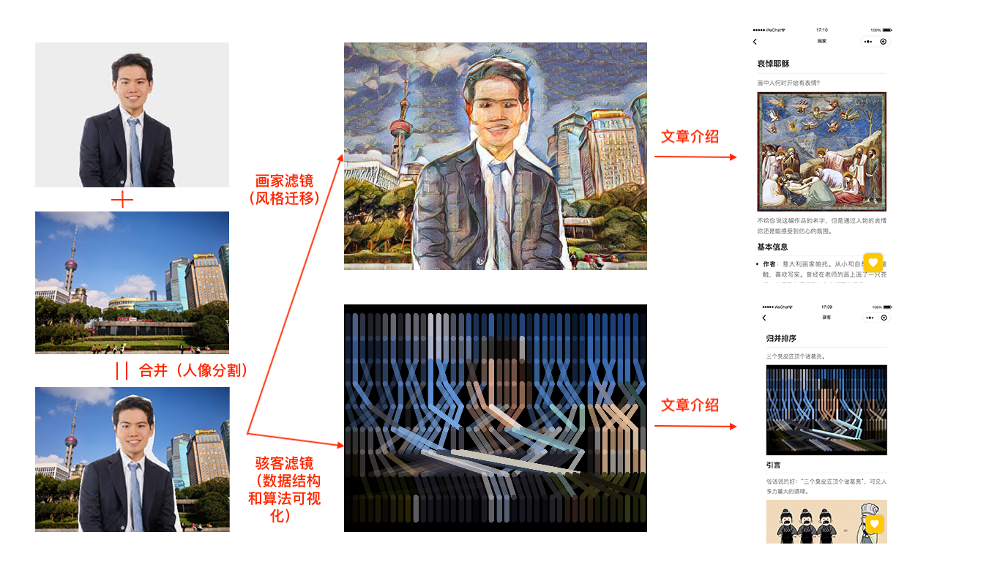

# 画家与骇客

艺术品高高在上，数据结构和算法神秘莫测，世界那么大，这一次，让画家和骇客带你去看看！

## 概述

《画家与骇客》给用户提供了一项有意思的服务：

- 第一步，用户选择一张风景图片和一张自拍，《画家与骇客》会用深度学习的方式将自拍中的人像扣出来贴在选择的风景图片上。
- 第二步，用户可以选择两种滤镜对图片进行处理：
  - 画家：把一些艺术品的风格通过风格迁移的方法迁移到合成的图片。
  - 骇客：在可视化一些数据结构和算法的过程中对合成的图片进行处理。
- 第三步，提供相应的文章讲解选择的艺术品或算法。

下面的一张图片简单的解释了该过程。

《画家与骇客》给用户提供了两个平台享受这个有意思的服务：[小程序](./wx-miniprogram)和[在线网页](./web)（在线网页目前还在开发中)。

  
## 实现方法

- **人像分割**：使用了 [Tensorflow.js/body-pix](https://github.com/tensorflow/tfjs-models/tree/master/body-pix)。
- **风格迁移**：
  - 使用 [DeepAi 提供的 API](https://deepai.org/machine-learning-model/fast-style-transfer)。
  - 支持风格迁移的艺术品具体查看[这里](./sdk)。
- **数据结构和算法可视化**：首先实现该数据结构和算法，然后测试，测试成功之后进行可视化。具体的数据结构和算法的实现和介绍请见[这里](./sdk)。

## 存在问题

- body-pix 的效果不是很理想。
- style-transfer 过程太慢。
  
## 未来工作

- 优化人像分割的效果。
- 用 tensorflow.js 实现风格迁移。
- 更多的数据结构和算法可视化。
- 更多的艺术品介绍。
- 开发网页平台。
