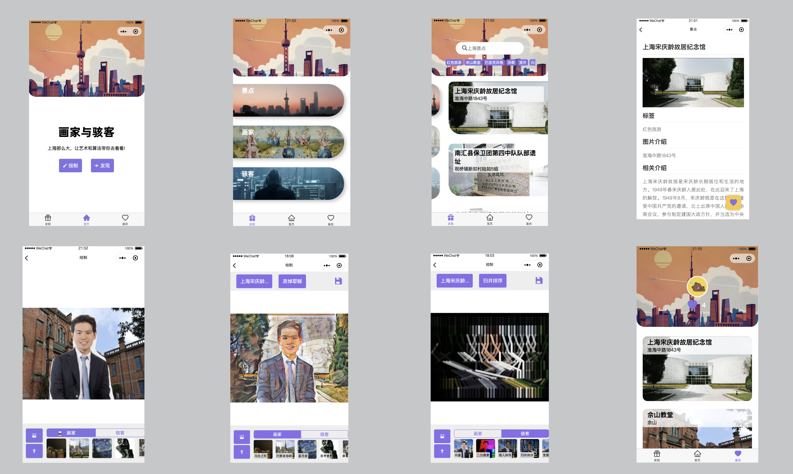

# 画家与骇客（小程序版本）

这是《画家与骇客》的小程序版本。


## 介绍

在小程序版本中，我们提供了一些上海红色景点和建筑给用户，用户在小程序中只能使用这些图片来作为合成图片中的背景。

所以在小程序中，希望用户在了解艺术品、数据结构和算法的同时，能了解上海红色景点和建筑。



## 说明

目前是用 tensorflow.js 的 body-pix 进行人像分割，为了适配 Android 端，需要修改构建后 `miniprogram_npm/@tensorflow-models/body-pix/index.js` 中 **1146** 行中的 `function getInputSize()` 如下：

```js
function getInputSize(input) {
    return [input.shape[0], input.shape[1]];
}
```

## 技术栈

原生小程序 + 小程序云开发

## 未来计划

- 优化界面
